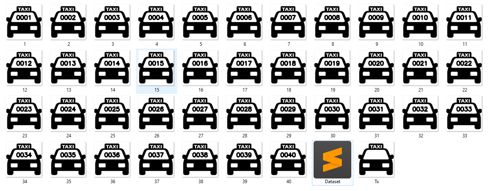

# Editando Imágenes
Este repositorio va destinado a la edición de imagenes mediante el uso de visión artificial.

# Como descargar las librerías necesarias para compilar el código
Copie y pegue cada una de los siguientes comandos en el CMD (Símbolo del sistema) ingresando los comandos línea por línea solo una a la vez:

python -m pip install -U pip

python -m pip install --upgrade pip

pip install opencv-python

# Descargar OpenCV en Ubuntu
Copie y pegue cada una de los siguientes comandos en el terminal ingresando los comandos línea por línea solo una a la vez:

### Python 2

sudo apt-get install python-pip

python -m pip install --upgrade pip

pip install --user opencv-python

### Python 3

sudo apt-get install python3-pip

pip3 install --user opencv-python

####

#### Autor: Sergio Beleño :octocat: ✒️
